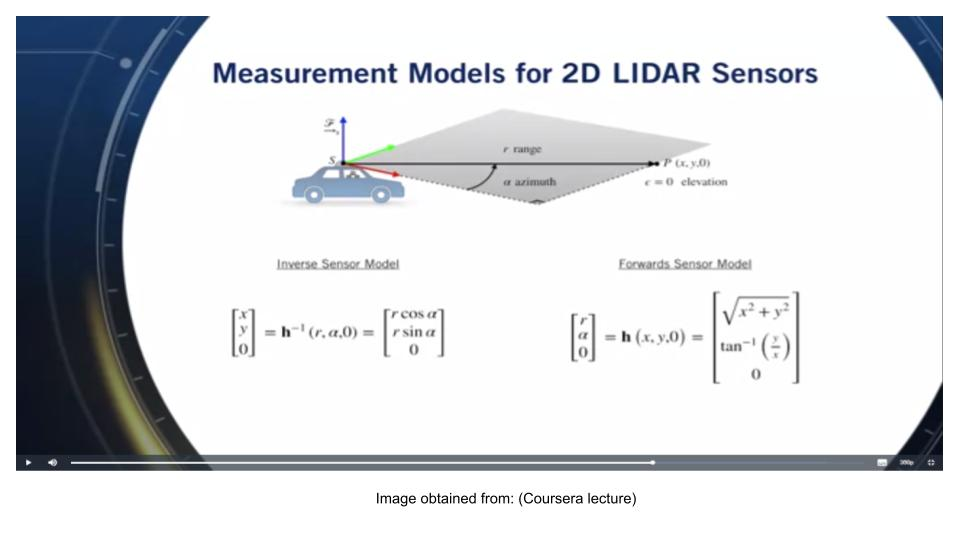
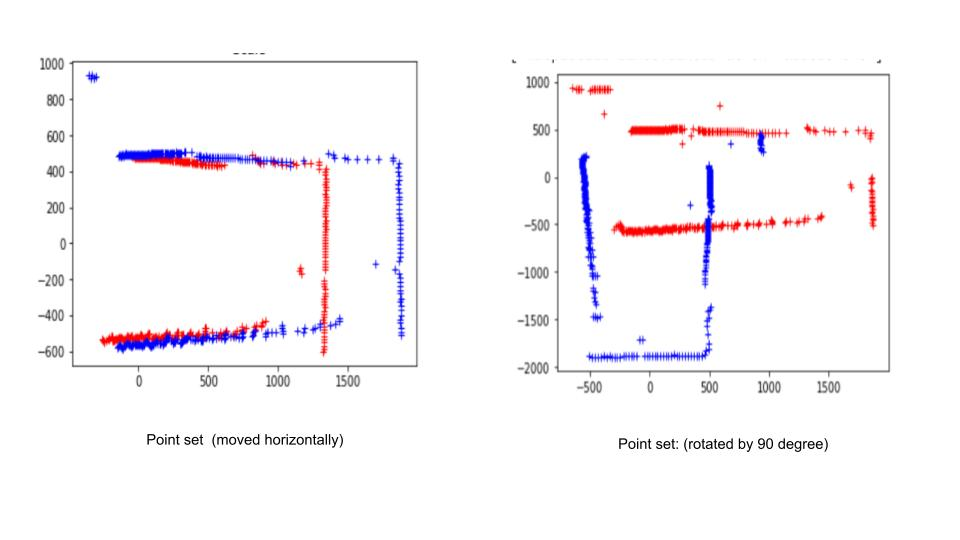

# Project Name: The Math Used In LiDaR
# Overview: 
This project can be used as an introductory Data Science project. In this project, I learned what data gets collected using Lidar sensors and what computational algorithms are used to convert that data into actionable perception such as navigating a self driving car. I studied C libraries of (RP Lidar, Standard SDK), and used Jupyter Notebook to map the data collected by a RPLidar device. Jupyter Notebook enabled the Linear Algebra calculations used by the optimization algorithm that I decided to study. 

The project is using RPLidar, a product by SLAMtech as a Lidar sensor. The RPLidar device is capable of doing a full 360 degree sweep of  the environment.  This device is a full 360 degree rotating Lidar similar to the type of Lidar sensor that we see on top of the self-driving vehicles also called Autonomous Vehicles or AV. Note that there are many other applications of Lidar. In early uses of Lidar technology, a famous Lidar use was for the Apollo 15 moon mission, where they used Lidar to do the topographical map of the section of the moon. 

 < 
This project has the following components:
  1) Problem Formulation 2)  Measurement 3) Data Transformation and Visualization 
4) Validation using Computational Algorithms.

# Part1- Problem Formulation:

A navigation problem using a Lidar sensor can be formulated in the form of State-estimation via Point Set Registration. Each point p that is scanned is registered as a discrete vector with the following parameters [r,A],  where r is the distance from the basis, and A is the angle. The problem can then be stated :

Let 	M be the Point set  <code>{ pi }</code>  and  i ranges from 0 to 360 degree,\
  and   Mb, Mt be two sets of corresponding points in <code>ℝd</code>  , where the first point set is Mb and the second point set is Mt

We wish to find a transformation that optimally aligns the two sets, i.e., we seek a rotation R and a translation vector t. So, our ground truth is the change in position of the device to obtain Mb, andMt .  Then I validate the transformation of Point sets  by using Mb, andMt  as input to the computation algorithm called Least-square algorithm,  published in IEEE Transactions on Pattern Analysis and Machine Learning” (Least-squares fitting).  Here is the basic framework of Least-squares algorithm. The optimal rigid 3D registration problem from vector measurements can be characterized as

L(R, t)      = <code>argmin 
    R∈SO(d), t∈ℝd Σ 1->n 
        wi || (R pi + t) − qi || 2 </code>

where,
- <code>wi</code> > 0 denotes the positive weight of i-th point pair; 
- R ∈ SO(3) is the direction cosine matrix (DCM) describing the 3D rotation; 
- t ∈ <code>ℝd</code>   denotes the translational vector; 
- <code>pi = (bx,i, by,i , bz,i ) p ∈ {Mb}      and qi = (tx,i, ty,i , tz,i ) q ∈ {Mt}   represent the i-th pair of point correspondences in first point set {Mb}  and second point set {Mt}, respectively. </code>
- L is called the metric error function that owns independent variables of R and t to be estimated

# Part2- Measurement:

The two point sets for the preimage, and the image are obtained using SLAMtech application frame grabber. SLAMtech is the  vendor of the RPLidar device and they provide applications written in C programming language. Output data is also written out to a csv file ( See the excerpts to C program that captures rplidar_response_measurement_node_hq_t). RPLidar, Standard SDK that is making this application possible can be downloaded to a Windows or Linux platform.

We can visualize the 360-degree view in the frame grabber applet as the device sweeps the plane by rotating the sensor. Each point in the csv file is formatted as  
- Flag (whether the point belongs to a new scan)
- Angle (Angle value in degree)
- Distance (Distance value in mm unit)
- Quality (Quality of the LASER intensity)

# Part3- Data Transformation and Visualization:
#### Mapping the Plane with Matrices:
We are going to consider a  N X 3 matrix, where N is the number of points data collected in a 360 degree sweep, and 3 coordinates determine a point in the 3D space. 
With the help of conversion calculations from polar form to complex form, the experimental data measured by the RPLidar device was registered  as  M [ N X 3], a 3D Point set. As mentioned earlier, the experimental data sets are the PreImage {Mb}, and  Image {Mt} obtained by making a  linear transformation of the position of the device. 

#### Graphing the Cartesian Plane:

We are going to graph and label the preimage and the image of each point onto the same set of axes. I am visualizing  the transformation by plot of the two point sets (using matplotlib). This enables us to visualize the transformation as can be seen from the red reference points and blue are the transformed point set.

# Part4- Validation with Computational Algorithm:
The studied optimization is seemingly a total least-square problem with reference and transformed observations. Many solutions have been developed to solve this optimization problem. The equivalent algorithm is explained in detail in Olga and Michaels paper ( Least-Squares Rigid Motion Using SVD). Algorithm computes the rotation R, and translation matrix t from matrices of point set using Linear algebra concepts namely Linear Transformation, Matriices, and Singular Value Decomposition SVD. The algorithm seeks the optimal direction cosine matrix for rotation, and translation vector to minimize the metric error from the 3D rigid transform. 

#### Steps of the algorithm:
  - i. { Mb } a set of points <code>pi</code> and {Mt} a set of points <code>qi</code>  where i = 0 to m, are  mapped to  m×3 data matrices.  
  - ii. Centroids p¯, and  q¯ are calculated for Am  Bm. The derivation for converting the equation to use centroids is explained in paper referenced below (Least-Squares Rigid Motion Using SVD)
  - iii. <code>A := pi − p¯,   B := qi − q¯ </code>
  - iv. Cross-covariance    C′=<code>ATB</code> 
  - v.  Singular Value Decomposition SVD(C′) = UΣV<code>T</code> 
  - vi. R=VU<code>T</code>   where  R is the desired rotation matrix.
  - vii. t = q¯ − Rp¯, In other words, the optimal translation t maps the transformed weighted centroid of Mb to the weighted centroid of Mt.

# References:
- 1 RPLidar SDK: User Manual, https://www.slamtec.com/en/Support#rplidar-a-series
- 2 Coursera Lecture: State-estimation via Point Set Registration https://www.coursera.org/lecture/state-estimation-localization-self-driving-cars/lesson-3-pose-estimation-from-lidar-data-XE9kZ
- 3 Least-squares fitting of two 3-D point sets in IEEE Transactions on Pattern Analysis and Machine Intelligence PAMI-9(5):698 - 700 , October 1987 
- 4 Olga Sorkine-Hornung and Michael Rabinovich Least-Squares Rigid Motion Using SVD, Department of Computer Science, ETH Zurich January 16, 2017 https://igl.ethz.ch/projects/ARAP/svd_rot.pdf
- 5 Rigid_Transform_3D: https://github.com/nghiaho12/rigid_transform_3D
- 6 Understanding 3D matrix transforms, https://medium.com/swlh/understanding-3d-matrix-transforms-with-pixijs-c76da3f8bd8
- 7 Understanding Singular Value Decomposition and its Application in Data Science, https://towardsdatascience.com/understanding-singular-value-decomposition-and-its-application-in-data-science-388a54be95d
