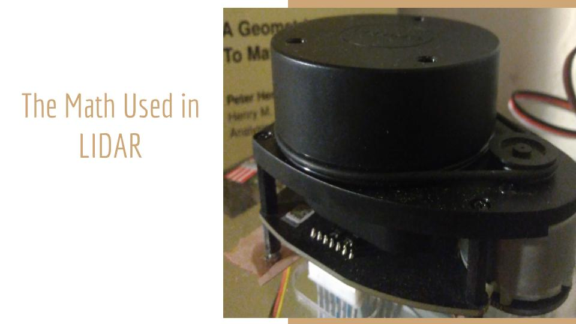
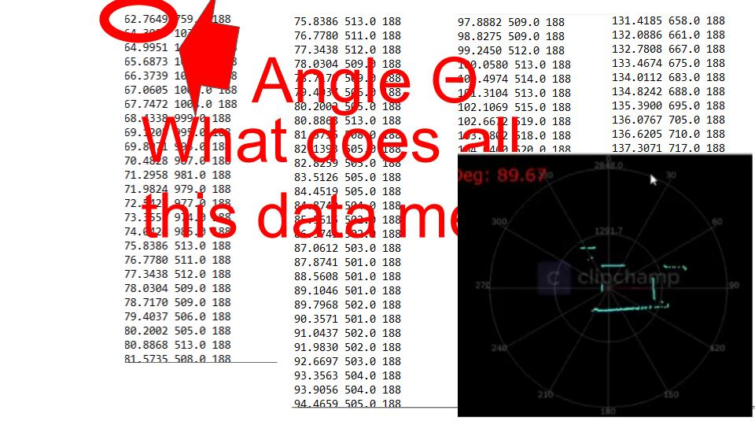

# Project Name: The Math Used In LiDaR
# Overview: 

The project is using RPLidar, a product by SLAMtech as a Lidar sensor. The RPLidar device is capable of doing a full 360 degree sweep of  the environment.  This device is a full 360 degree rotating Lidar similar to the type of Lidar sensor that we see on top of the self-driving vehicles also called Autonomous Vehicles or AV. In early uses of Lidar technology, a famous Lidar use was for the Apollo 15 moon mission, where they used Lidar to do the topographical map of the section of the moon.  

In this project, I learned what data gets collected using Lidar sensors and what computational algorithms are used to convert that data into actionable perception for navigating a self driving car.   I used Python, and C libraries to map the data collected by my RPLidar device into matrix form. This enabled the Linear Algebra calculations used by the optimization algorithm that I decided to study. The calculations used in the algorithm also teach basics in data science.

# Part1- Measurement:

SLAMtech is the  vendor of the RPLidar device and they provide applications written in C programming language.  (RPLidar, Standard SDK)  can be downloaded to a Windows or Linux platform. The program outputs 360-degree view data which can also be visualized using Frame Grabber applet available with SDK. 

The lidar data from the device can also be obtained from the elements in this C structure as output data. Each record in the file is formatted as  
- Flag (whether the point belongs to a new scan)
- Angle (Angle value in degree)
- Distance (Distance value in mm unit)
- Quality (Quality of the LASER intensity)

# Part2- Problem Formulation:
A navigation problem using a Lidar sensor can be formulated in the form of State-estimation via Point Set Registration. Each point p that is scanned is registered as a discrete vector with the following parameters [r,A],  where r is the distance from the basis, and A is the angle.  (Coursera lecture)
The problem can then be stated :
Let 	M be the Point set  {pi}  and  i ranges from 0 to 360 degree,
and   Mb, Mt be two sets of corresponding points in ℝd , where the first point set is Mb and the second point set is Mt
We wish to find a transformation that optimally aligns the two sets, i.e., we seek a rotation R and a translation vector t.

With the help of conversion calculations from polar form to complex form, the experimental data measured by the RPLidar device was registered  as  M, a 3D Point set. 
For the experimental data  PreImage {Mb}, and transformed data {Mt} was obtained by making a  linear transformation of the position of the device.   

So, our ground truth is the change in position of the device, and then I am validating the transformation by taking Point sets  Mb, Mt as input to an algorithm used for finding rotation and translation, that uses the computation algorithm published in IEEE Transactions on Pattern Analysis and Machine Learning” (Least-squares fitting). Here is the basic framework of Least-squares algorithm. The optimal rigid 3D registration problem from vector measurements can be characterized as

L(R, t)      =

argmin 
    R∈SO(d), t∈ℝd 
1 n wi || (R pi + t) − qi || 2 

where,
- wi > 0 denotes the positive weight of i-th point pair; 
- R ∈ SO(3) is the direction cosine matrix (DCM) describing the 3D rotation; 
- t ∈ ℝd   denotes the translational vector; 
- pi = (bx,i, by,i , bz,i ) p ∈ {Mb}      and qi = (tx,i, ty,i , tz,i ) q ∈ {Mt}   represent the i-th pair of point correspondences in first point set {Mb}  and second point set {Mt}, respectively. 
- L is called the metric error function that owns independent variables of R and t to be estimated

# Part3- Visualization:
Also, used matplotlib to plot the two point sets obtained from using SLAMtech application frame grabber. This enabled us to visualize the transformation as can be seen from the red reference points and blue are the transformed point set.

# Part4- Validation:
The studied optimization is seemingly a total least-square problem with reference and transformed observations. Many solutions have been developed to solve this optimization problem. The equivalent algorithm is explained in detail in Olga and Michaels paper ( Least-Squares Rigid Motion Using SVD). The algorithm seeks the optimal direction cosine matrix for rotation, and translation vector to minimize the metric error from the 3D rigid transform. Algorithm computes the rotation R, and translation matrix t from matrices of point set using Linear algebra concepts namely Linear Transformation, Orthogonal Matrix, and Singular Value Decomposition SVD.

Concept of SVD:  In linear algebra, the Singular Value Decomposition (SVD) of a matrix X is a factorization of that matrix into three matrices U, S, and V. Calculating the SVD consists of finding the eigenvalues and eigenvectors of AAT and ATA. The eigenvectors of XTX make up the columns of X , the eigenvectors of XXT  make up the columns of U. Also, the singular values in S are square roots of eigenvalues from XXT or XTX.  The singular values are the diagonal entries of the S matrix and are arranged in descending order. 

# Part5- Computer Program for Data Science:
Steps of the Algorithm:
  - i. { Mb } a set of points pi and {Mt} a set of points qi  where i = 0 to m, are  mapped to  m×3 data matrices.  
  - ii. Centroids p¯, and  q¯ are calculated for Am  Bm. The derivation for converting the equation to use centroids is explained in paper referenced below (Least-Squares Rigid Motion Using SVD)
  - iii. A := pi − p¯,   B := qi − q¯ 
  - iv. Cross-covariance    C′=ATB 
  - v.  Singular Value Decomposition SVD(C′) = UΣVT
  - vi. R=VUT  where  R is the desired rotation matrix.
 - vii. t = q¯ − Rp¯, In other words, the optimal translation t maps the transformed weighted centroid of Mb to the weighted centroid of Mt.

# References:
- 1 RPLidar SDK: User Manual, https://www.slamtec.com/en/Support#rplidar-a-series
- 2 Coursera Lecture: State-estimation via Point Set Registration https://www.coursera.org/lecture/state-estimation-localization-self-driving-cars/lesson-3-pose-estimation-from-lidar-data-XE9kZ
- 3 Least-squares fitting of two 3-D point sets in IEEE Transactions on Pattern Analysis and Machine Intelligence PAMI-9(5):698 - 700 , October 1987 
- 4 Olga Sorkine-Hornung and Michael Rabinovich Least-Squares Rigid Motion Using SVD, Department of Computer Science, ETH Zurich January 16, 2017 https://igl.ethz.ch/projects/ARAP/svd_rot.pdf
- 5 Rigid_Transform_3D: https://github.com/nghiaho12/rigid_transform_3D
- 6 Understanding 3D matrix transforms, https://medium.com/swlh/understanding-3d-matrix-transforms-with-pixijs-c76da3f8bd8
- 7 Understanding Singular Value Decomposition and its Application in Data Science, https://towardsdatascience.com/understanding-singular-value-decomposition-and-its-application-in-data-science-388a54be95d
